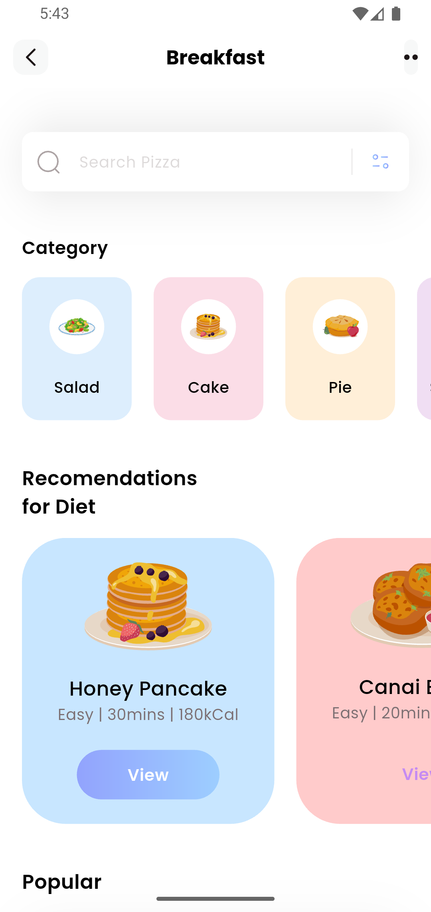
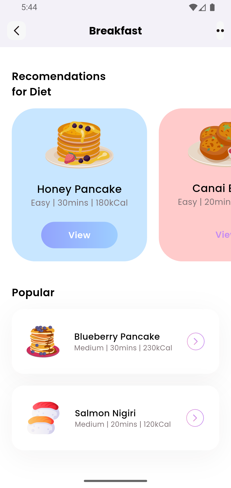

# 🍽️ Trell - Food Recipe App

A beautiful Flutter UI application for food recipes and diet recommendations, designed from scratch using Figma and implemented with clean, modern UI components.

## 📱 About the Project

This project was created to learn Flutter UI basics and demonstrates a complete food recipe application with:
- **Custom UI Design**: Originally designed in Figma and then implemented in Flutter
- **Modern UI Components**: Clean, responsive design with custom widgets
- **Food Categories**: Interactive category selection with colorful icons
- **Diet Recommendations**: Horizontal scrolling diet cards with gradient buttons
- **Popular Recipes**: Vertical list of popular food items with detailed information

## 🎨 Design Features

- **Custom Font**: Poppins font family for modern typography
- **SVG Icons**: Custom SVG icons for better scalability
- **Color Scheme**: Soft, food-themed color palette
- **Gradient Buttons**: Beautiful gradient effects for interactive elements
- **Card-based Layout**: Clean card design with subtle shadows
- **Responsive Design**: Optimized for mobile devices

## 🏗️ Project Structure

```
lib/
├── main.dart                 # App entry point
├── models/
│   ├── categorymodels.dart  # Food category data models
│   ├── dietmodels.dart      # Diet recommendation models
│   └── popularmodels.dart   # Popular recipes models
└── pages/
    └── homepage.dart        # Main application screen
```

## 📊 Widget Tree

```
MyApp
└── MaterialApp
    └── Homepage
        └── Scaffold
            ├── AppBar (Custom)
            │   ├── Leading: Back Button
            │   ├── Title: "Breakfast"
            │   └── Actions: Menu Button
            └── ListView
                ├── SearchBar
                │   ├── TextField
                │   ├── Search Icon
                │   └── Filter Icon
                ├── CategorySection
                │   └── ListView (Horizontal)
                │       └── CategoryCard
                │           ├── Icon Container
                │           └── Category Name
                ├── DietSection
                │   └── ListView (Horizontal)
                │       └── DietCard
                │           ├── Food Icon
                │           ├── Food Details
                │           └── View Button
                └── PopularSection
                    └── ListView (Vertical)
                        └── PopularCard
                            ├── Food Icon
                            ├── Food Details
                            └── Action Button
```

## 🚀 Getting Started

### Prerequisites
- Flutter SDK (3.9.2 or higher)
- Dart SDK
- Android Studio / VS Code
- Git

### Installation

1. **Clone the repository**
   ```bash
   git clone https://github.com/yourusername/trell.git
   cd trell
   ```

2. **Install dependencies**
   ```bash
   flutter pub get
   ```

3. **Run the application**
   ```bash
   flutter run
   ```

## 📦 Dependencies

- `flutter_svg: ^2.2.1` - For SVG icon support
- `cupertino_icons: ^1.0.8` - iOS-style icons

## 🎯 Key Features

### 1. **Search Functionality**
- Custom search bar with search and filter icons
- Placeholder text: "Search Pizza"
- Clean, modern design with shadow effects

### 2. **Category Section**
- Horizontal scrolling categories
- 4 food categories: Salad, Cake, Pie, Smoothies
- Color-coded category cards with custom icons
- Circular icon containers with white backgrounds

### 3. **Diet Recommendations**
- Horizontal scrolling diet cards
- Gradient view buttons
- Food details: Level, Duration, Calories
- Interactive selection states

### 4. **Popular Recipes**
- Vertical list of popular food items
- Detailed information display
- Action buttons for each item
- Card-based layout with shadows

## 🎨 UI Components

### Custom AppBar
- Clean white background
- Custom back button with rounded container
- Center-aligned title
- Menu button with dots icon

### Search Bar
- White background with shadow
- Search icon on the left
- Filter icon on the right
- Rounded corners and clean typography

### Category Cards
- Rounded rectangle containers
- Color-coded backgrounds
- Circular icon containers
- Clean typography

### Diet Cards
- Large horizontal cards
- Gradient view buttons
- Food icons and details
- Interactive selection states

## 🎨 Color Palette

- **Primary Colors**: Soft blues, pinks, oranges, purples
- **Background**: White (#FFFFFF)
- **Text**: Black (#000000) and Gray (#7B6F72)
- **Shadows**: Light gray with opacity
- **Gradients**: Blue to light blue transitions

## 📱 Screenshots

### Main App Interface

*Clean, modern interface with search bar, categories, and diet recommendations*

### App Features in Action

*Interactive category selection, diet recommendations, and popular recipes*

The app features a clean, modern interface with:
- Beautiful food category icons
- Smooth scrolling lists
- Interactive buttons and cards
- Professional typography using Poppins font

## 🛠️ Development

This project was built to learn Flutter UI fundamentals:
- **State Management**: Using StatefulWidget for dynamic content
- **Custom Widgets**: Reusable UI components
- **Layout Design**: Proper use of Rows, Columns, and Containers
- **Styling**: Custom colors, fonts, and decorations
- **Asset Management**: SVG icons and custom fonts

## 📄 License

This project is created for educational purposes and learning Flutter UI development.

## 🤝 Contributing

Feel free to fork this project and submit pull requests for any improvements.

## 📞 Contact

Created as a learning project for Flutter UI development.

---

**Note**: This project was originally designed in Figma and then implemented in Flutter to learn UI development basics. The design focuses on clean, modern aesthetics with a food-themed color scheme and intuitive user experience. **This project was built entirely from scratch without any AI assistance - all code, design, and implementation was done manually.** 